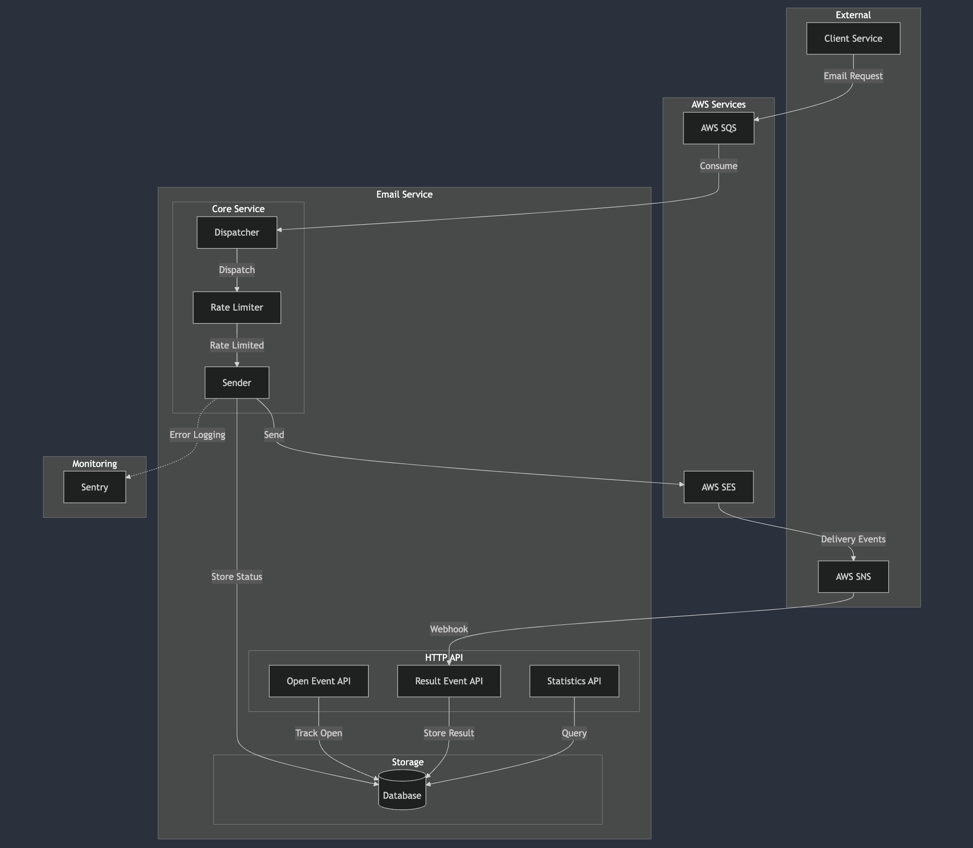

# aws-ses-sender-go

[한국어](README.ko.md) | [English](README.md)

`aws-ses-sender-go`는 대량 이메일 발송을 위한 고성능 시스템입니다. AWS SQS, SES, SNS를 활용하여 안정적인 이메일 발송과 결과 추적을 제공합니다. 특히 최소한의 리소스로 최대의 성능을 발휘하도록 설계되었습니다.

## 시스템 구조

### 아키텍처


### 이벤트 흐름


## 핵심 기능

- **비동기 처리**: AWS SQS를 활용한 메시지 큐잉
- **대량 발송**: AWS SES 기반의 안정적인 이메일 발송
- **실시간 추적**: AWS SNS를 통한 발송 결과 수집
- **열람 분석**: 이미지 태그 기반 이메일 오픈율 추적
- **통계 제공**: Plan 단위의 상세 발송 통계
- **오류 모니터링**: Sentry 기반 실시간 에러 추적

## API 명세

### 이메일 오픈 추적
```http
GET /v1/events/open?requestId={메시지_요청ID}
Response: 1x1 투명 픽셀
```

### 발송 결과 수신 (SNS Webhook)
```http
POST /v1/events/result
{
    "Type": "Notification",
    "Message": {
        "eventType": "Delivery|Bounce|Complaint",
        "mail": {
            "messageId": "STRING"
        }
    }
}
```

### 통계 조회
```http
# Plan별 발송 현황
GET /v1/results/count/:planId
{
    "total": 1000,    // 전체 발송 수
    "created": 100,   // 발송 대기
    "sent": 850,      // 발송 성공
    "failed": 30,     // 발송 실패
    "stopped": 20     // 발송 중단
}

# 24시간 발송량
GET /v1/results/sent?hours=24
{
    "count": 50000    // 발송 수
}
```

## 핵심 컴포넌트

### Dispatcher
- SQS 메시지 수신 및 검증
- 발송 요청 분배 및 제어
- Dead Letter Queue 처리

### Sender
- Token Bucket 기반 Rate Limiting
- SES 발송 제어
- 상태 관리 및 결과 추적

### HTTP API
- 이메일 오픈 이벤트 처리
- SNS 웹훅 엔드포인트 제공
- 통계 데이터 집계 및 제공

## 환경 설정

```bash
# AWS 설정
EMAIL_SENDER=noreply@example.com
AWS_ACCESS_KEY_ID=your_access_key
AWS_SECRET_ACCESS_KEY=your_secret_key

# 서버 설정
SERVER_HOST=http://localhost
SERVER_PORT=3000
EMAIL_RATE=14

# 모니터링
SENTRY_DSN=your_sentry_dsn
```

## 성능 최적화

### 발송 제어
- Token Bucket 알고리즘으로 정교한 발송 제어
- AWS SES 할당량 자동 준수
- 동적 발송 속도 조절

### 데이터 처리
- 1000건 단위 벌크 업데이트
- 10초 주기 일괄 처리
- 트랜잭션 기반 데이터 정합성 보장

### 운영 효율
- 메모리 사용 최적화
- 고루틴 기반 동시성 처리
- 효율적인 리소스 관리

## 시작하기

```bash
# 저장소 복제
git clone https://github.com/lee-lou2/aws-ses-sender-go.git
cd aws-ses-sender-go

# 의존성 설치
go mod download

# 환경 설정
cp .env.example .env
vim .env

# 서버 실행
go run .
```

## 라이선스

MIT License