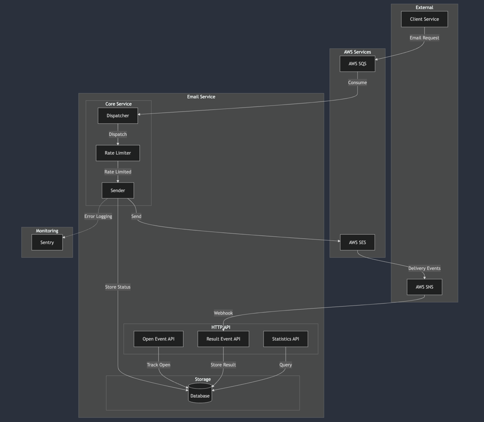
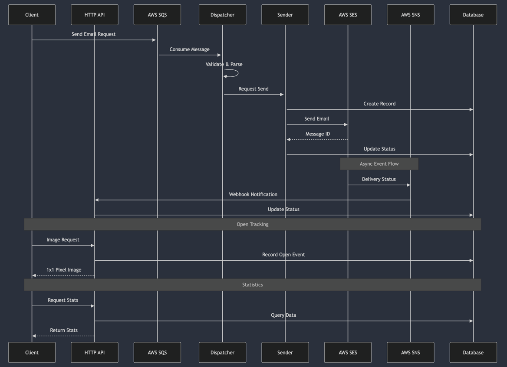

# aws-ses-sender-go

[한국어](README.ko.md) | [English](README.md)

`aws-ses-sender-go` is a high-performance email delivery system built in Go. It leverages AWS SQS for request handling, AWS SES for email delivery, and AWS SNS for delivery status tracking. The system is designed to achieve maximum efficiency with minimal resource usage.

## System Architecture

### Overview


### Event Flow


## Core Features

- **Asynchronous Processing**: Message queuing using AWS SQS
- **Bulk Delivery**: Reliable email delivery via AWS SES
- **Real-time Tracking**: Delivery status collection through AWS SNS
- **Open Tracking**: Email open rate tracking using image tags
- **Statistics**: Detailed delivery statistics by Plan
- **Error Monitoring**: Real-time error tracking with Sentry

## API Specification

### Email Open Tracking
```http
GET /v1/events/open?requestId={requestId}
Response: 1x1 transparent pixel
```

### Delivery Status Reception (SNS Webhook)
```http
POST /v1/events/result
{
    "Type": "Notification",
    "Message": {
        "eventType": "Delivery|Bounce|Complaint",
        "mail": {
            "messageId": "STRING"
        }
    }
}
```

### Statistics Endpoints
```http
# Delivery Status by Plan
GET /v1/results/count/:planId
{
    "total": 1000,    // Total emails
    "created": 100,   // Pending
    "sent": 850,      // Successfully sent
    "failed": 30,     // Failed
    "stopped": 20     // Stopped
}

# 24-hour Delivery Count
GET /v1/results/sent?hours=24
{
    "count": 50000    // Number of emails sent
}
```

## Core Components

### Dispatcher
- SQS message reception and validation
- Delivery request distribution and control
- Dead Letter Queue handling

### Sender
- Token Bucket-based Rate Limiting
- SES delivery control
- Status management and result tracking

### HTTP API
- Email open event handling
- SNS webhook endpoint provisioning
- Statistics aggregation and delivery

## Configuration

```bash
# AWS Settings
EMAIL_SENDER=noreply@example.com
AWS_ACCESS_KEY_ID=your_access_key
AWS_SECRET_ACCESS_KEY=your_secret_key

# Server Settings
SERVER_HOST=http://localhost
SERVER_PORT=3000
EMAIL_RATE=14

# Monitoring
SENTRY_DSN=your_sentry_dsn
```

## Performance Optimization

### Delivery Control
- Precise delivery control using Token Bucket algorithm
- Automatic AWS SES quota compliance
- Dynamic delivery rate adjustment

### Data Processing
- Bulk updates in batches of 1000
- 10-second interval batch processing
- Transaction-based data consistency

### Operational Efficiency
- Optimized memory usage
- Goroutine-based concurrency
- Efficient resource management

## Getting Started

```bash
# Clone repository
git clone https://github.com/lee-lou2/aws-ses-sender-go.git
cd aws-ses-sender-go

# Install dependencies
go mod download

# Configure environment
cp .env.example .env
vim .env

# Run server
go run .
```

## License

MIT License